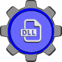

# DLL Icon Forge

  

DLL Icon Forge is a Windows desktop app for creating and editing icon library DLLs.

It helps you collect icon images (`.ico`, `.png`, `.jpg`, `.webp`, `.svg`), preview them, fix non-square images, organize the icon order, and generate a resource-only `.dll` that can be used as a Windows icon library. Existing DLLs can also be opened, inspected, adjusted, and rebuilt into a new output file.

## What It Does

DLL Icon Forge provides a focused workflow for building and maintaining Windows icon library DLLs.

**Create and edit icon libraries**

- Build new resource-only `.dll` icon libraries from `.ico`, `.png`, `.jpg`/`.jpeg`, `.webp`, and `.svg` files.
- Open existing icon DLLs, extract readable icon groups, and rebuild the result to a new output file.
- Use native Windows open/save dialogs for selecting source files and choosing the final DLL path.

**Review and organize icons**

- Browse imported icons in grid or list view.
- Adjust page size, move between pages, and search icons by index.
- Select, remove, crop, and reorder icons before saving.
- Reorder with up/down controls or drag and drop, including a ghost preview while dragging and automatic page switching when held near an edge.

**Validate before saving**

- Detect non-square imported images before build time.
- Block saving while invalid icons are present, with a clear notice explaining what needs attention.
- Use the built-in 1:1 crop editor to fix non-square images and prepare them for DLL generation.

**Work comfortably**

- Receive success, warning, and error notifications for important operations.
- Get a confirmation prompt before leaving a project with unsaved changes.
- Switch between light and dark themes.
- Use the app in Italian, English, French, Spanish, or German.

## How It Works

### Create A New DLL

1. Choose **Create** from the home screen.
2. Add one or more icon files (`.ico`, `.png`, `.jpg`, `.jpeg`, `.webp`, `.svg`).
3. Review the previews in grid or list view.
4. Crop non-square icons or remove icons you do not want to include.
5. Reorder icons with the move controls or by dragging the move handle.
6. Generate the DLL.
7. Choose where to save the output `.dll`.

### Edit An Existing DLL

1. Choose **Edit** from the home screen.
2. Select an existing `.dll`.
3. Review the icons extracted from the file.
4. Remove, crop, reorder, or add new icon files (`.ico`, `.png`, `.jpg`, `.jpeg`, `.webp`, `.svg`).
5. Generate a new DLL and choose the output path.

The original DLL is not modified in place. DLL Icon Forge always writes the result to the output path you choose.

### Icon Validation And Crop

Icons must be square before the DLL can be saved. If an imported image is not square, it is marked as invalid and the save action is disabled. Use **Crop** on the icon, or select exactly one icon and use the toolbar crop action, to open the square editor.

The crop editor keeps a 1:1 selection ratio. You can move and resize the selection to choose the final square image that will be normalized for the DLL build.

### Organizing Icons

The preview area supports:

- Grid and list view.
- Page sizes of 10, 20, 30, 40, or 50 icons.
- Search by icon index.
- Reordering with up/down buttons.
- Reordering by dragging the move handle when more than one icon is available.
- Automatic page switching during drag when the pointer stays near a previous/next page edge for 2 seconds.

Drag and drop reordering is disabled when there is only one icon or when a search filter is active.

## Supported Files

Input files:

- `.ico`
- `.png`
- `.jpg` / `.jpeg`
- `.webp`
- `.svg`
- existing `.dll` files containing icon resources

Output:

- resource-only `.dll` icon libraries

## Windows SmartScreen Warning

When you run the installer for the first time, Windows SmartScreen may show a warning saying the publisher is unknown. This happens because the executable is not code-signed with a commercial certificate.

The application is safe to use. If you prefer not to dismiss the SmartScreen prompt, you can build the application yourself directly from source — all the instructions are in [DEVELOPMENT.md](DEVELOPMENT.md).

## Privacy

DLL Icon Forge runs locally on your machine. Files you import are processed offline and are not uploaded anywhere. The app does not include telemetry or cloud services.

## License

The project is released under **The Unlicense**. See [LICENCE](LICENCE).
